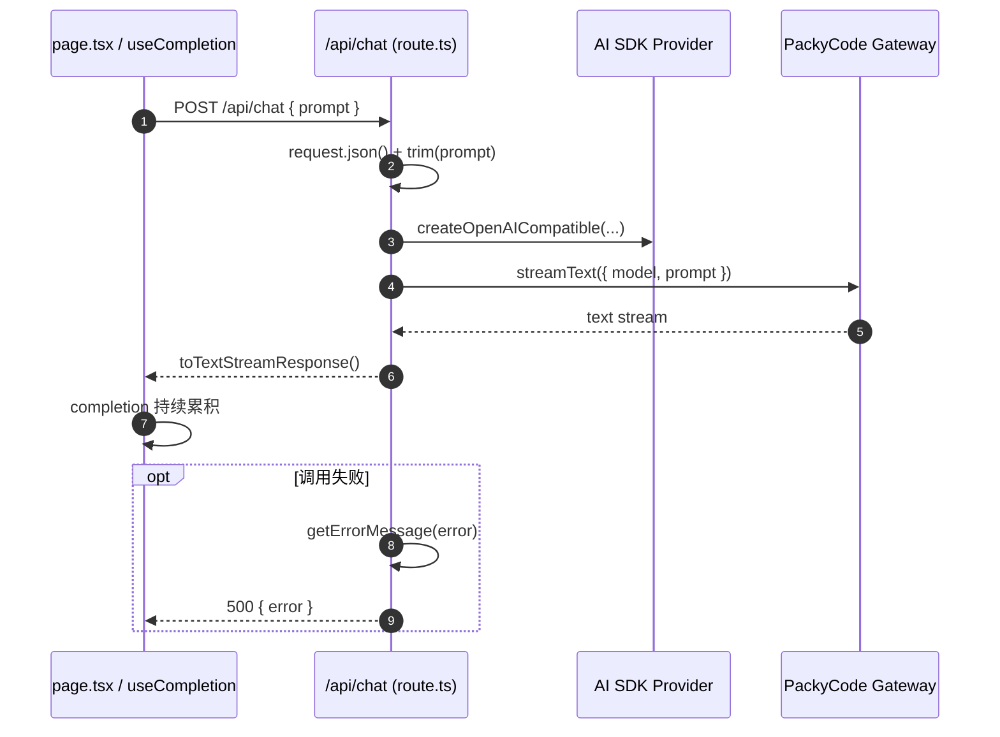

# `./src/app/api/chat/route.ts` 代码说明

## 文件定位

- 路径：`./src/app/api/chat/route.ts`
- 类型：Next.js App Router 的 Route Handler
- 方法：`POST`
- 作用：接收前端 `prompt`，通过 Vercel AI SDK 调用 PackyCode 网关，并返回文本流

---

## 当前实现的核心结论

当前项目真正生效的路径不是 raw `client.responses.create(...)`，而是：

- `createOpenAICompatible()`：把 PackyCode 网关接成 AI SDK provider
- `streamText()`：发起流式文本生成
- `toTextStreamResponse()`：把结果转成浏览器可读的文本流

也就是说：

- 前端请求字段是 `prompt`
- 服务端返回是纯文本流
- 页面消费方式是 `useCompletion()`

---

## 1) 环境变量与 provider 初始化

当前文件会读取这些环境变量：

- `PACKYCODE_API_KEY`
- `PACKYCODE_BASE_URL`
- `PACKYCODE_MODEL`

当前活跃代码里的 provider 初始化是：

```ts
const packycode = createOpenAICompatible({
  name: "packycode",
  apiKey,
  baseURL,
});
```

这一步的作用是：

- 继续沿用 PackyCode 的 OpenAI-compatible 地址
- 但把网关包装成 AI SDK 能直接消费的 provider

注意：`route.ts` 里还保留了 `OpenAI` import、`PACKYCODE_TIMEOUT_MS` 变量和一段旧注释。它们属于历史排障痕迹，不是当前主流程。

---

## 2) `maxDuration = 30` 的作用

```ts
export const maxDuration = 30;
```

这是 Next.js / Vercel 读取的约定导出，不需要手动调用。

它的意义是：

- 为这条流式路由声明最长运行时间
- 避免平台过早切断长响应

---

## 3) 错误信息处理：`getErrorMessage(error)`

这段函数用于把未知异常转成更可读的字符串。

当前逻辑重点是：

- 如果遇到 `Request timed out.`，就返回更明确的代理 / 网络提示
- 其他普通错误则返回 `error.message`

这样页面或日志更容易区分：

- 是代码契约问题
- 还是服务端根本没出网

---

## 4) 当前请求 / 返回契约

### 请求体

当前前端默认发送：

```json
{
  "prompt": "请用一句话总结前端需求拆解助手的作用"
}
```

所以服务端读取的是：

```ts
const body = await request.json();
const prompt = String(body.prompt ?? "").trim();
```

### 返回值

当前返回的是：

```ts
return result.toTextStreamResponse();
```

这意味着 `/api/chat` 不是一个返回固定 JSON 的接口，而是一个文本流接口。

如果前端还在按下面方式读取：

```ts
const data = await res.json();
```

那就和当前实现不兼容。

---

## 5) 接口主流程：`POST(request)`

当前实现流程可以拆成 6 步：

1. `await request.json()`
2. `const prompt = String(body.prompt ?? "").trim()`
3. 校验 `apiKey / baseURL / prompt`
4. 创建 `packycode` provider
5. 调用 `streamText({ model: packycode.chatModel(model), prompt, onFinish })`
6. `return result.toTextStreamResponse()`

关键代码是：

```ts
const result = streamText({
  model: packycode.chatModel(model),
  prompt,
  onFinish(event) {
    console.log("[/api/chat] finish");
    console.log("[/api/chat] prompt:", prompt);
    console.log("[/api/chat] text:", event.text);
  },
});

return result.toTextStreamResponse();
```

这就是当前 streaming 的核心。

---

## 6) 时序图



---

## 7) 这份实现当前没有提供什么

当前这条最小实现没有直接提供：

- `responseId`
- token usage
- finish reason 等结构化元数据

这不是 AI SDK 做不到，而是因为当前返回方式选择了最简单的文本流协议。

如果后续需要这些信息，应考虑：

- AI SDK 的 UI message stream
- 或者自定义 SSE / JSON stream 协议

---

## 8) 历史说明

文件里保留的注释中还能看到：

- `chat.completions` 版本
- raw `responses.create(...)` 版本

它们对应的是本次兼容性排障历史，不是当前仓库默认实现。