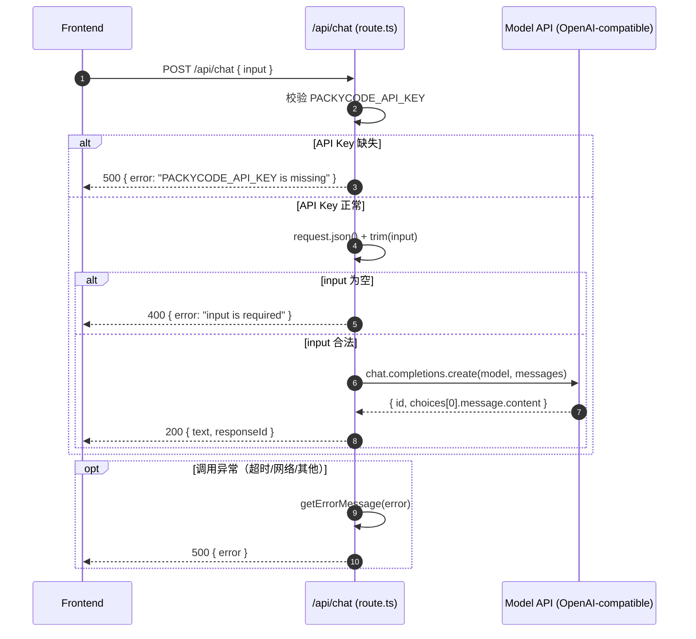

# `./src/app/api/chat/route.ts` 代码说明

## 文件定位

- 路径：`./src/app/api/chat/route.ts`
- 类型：Next.js App Router 的 Route Handler
- 方法：`POST`
- 作用：接收前端 `input`，调用大模型接口，返回模型输出

---

## 1) 配置与客户端初始化

代码会先读取环境变量并初始化 `OpenAI` 客户端：

- `PACKYCODE_API_KEY`：模型服务 API Key（必填）
- `PACKYCODE_BASE_URL`：自定义 API 网关地址（可选）
- `PACKYCODE_MODEL`：模型名，默认 `gpt-5.4`
- `PACKYCODE_TIMEOUT_MS`：请求超时时间，默认 `60000` ms

客户端配置关键点：

- `timeout`：超时控制
- `maxRetries: 0`：不自动重试，失败直接抛错

---

## 2) 错误信息处理：`getErrorMessage(error)`

这个函数用于统一错误输出：

- 如果是普通 `Error`，优先返回 `error.message`
- 如果 message 是 `"Request timed out."`，会转成更可读的提示：
  - `"Request timed out. Check proxy/network for Node.js runtime."`
- 非 `Error` 类型则返回 `"unknown error"`

---

## 3) 模型调用封装：`callModel(input)`

`callModel` 只做一件事：把用户输入转发给模型。

请求结构：

- `model`：来自环境变量（或默认值）
- `messages`：仅包含一条 user 消息

返回结构：

- `text`：`chat.choices[0]?.message?.content ?? ""`
- `responseId`：`chat.id`

---

## 4) 接口主流程：`POST(request)`

按执行顺序可分为 5 步：

1. **检查 API Key**
   - 若 `PACKYCODE_API_KEY` 缺失，返回 `500`
   - 响应：`{ error: "PACKYCODE_API_KEY is missing" }`

2. **解析请求体**
   - `const body = await request.json()`
   - `const input = String(body.input ?? "").trim()`

3. **参数校验**
   - 若 `input` 为空，返回 `400`
   - 响应：`{ error: "input is required" }`

4. **调用模型并返回结果**
   - `const result = await callModel(input)`
   - 正常返回 `200`：`{ text, responseId }`

5. **兜底异常处理**
   - 打印日志：`console.error("[/api/chat] error:", error)`
   - 返回 `500` + 统一错误信息

---

## 时序图（前端 -> API 路由 -> 模型）



---

## 响应示例

### 成功（200）

```json
{
  "text": "这是模型的回复内容",
  "responseId": "chatcmpl_xxx"
}
```

### 参数错误（400）

```json
{
  "error": "input is required"
}
```

### 服务错误（500）

```json
{
  "error": "PACKYCODE_API_KEY is missing"
}
```

