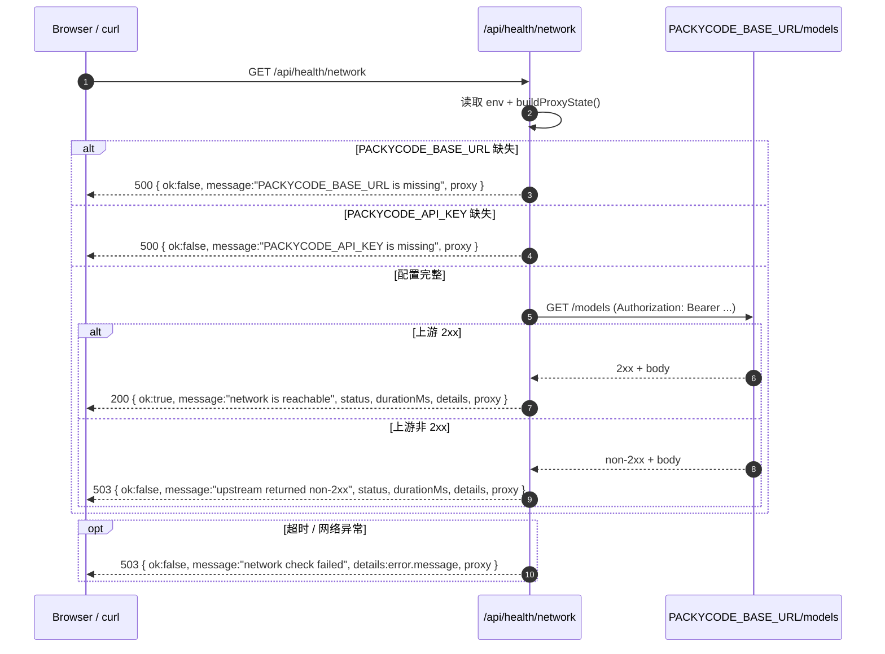

# `./src/app/api/health/network/route.ts` 代码说明

## 文件定位

- 路径：`./src/app/api/health/network/route.ts`
- 类型：Next.js App Router 的 Route Handler
- 方法：`GET`
- 作用：检测服务端到上游模型网关的网络连通性，并返回代理 / 耗时 / 状态信息

---

## 这个接口解决什么问题

这个接口只回答一个问题：

`当前 Node 进程能不能访问上游网关的 /models。`

它能帮助你判断：

- Node 是否能出网
- 代理环境变量是否注入成功
- `PACKYCODE_BASE_URL` 和 `PACKYCODE_API_KEY` 是否至少能用于基础连通测试

但它不能直接证明：

- `/api/chat` 的 `prompt` 契约一定正确
- AI SDK provider 一定配置正确
- `toTextStreamResponse()` 的文本流一定已经正确到达页面
- 业务调用一定没问题

所以这个接口是“网络诊断”，不是“业务诊断”。

---

## 1) 响应结构：`HealthPayload`

统一返回结构里包含：

- `ok`：连通性是否成功
- `message`：结果说明
- `durationMs`：本次检测耗时
- `target`：实际探测地址（`<baseURL>/models`）
- `status`：上游 HTTP 状态码（如果请求发出成功）
- `details`：上游响应片段或错误信息
- `proxy`：当前 Node 进程代理环境状态

---

## 2) 代理状态采集：`buildProxyState()`

当前实现会收集：

- `NODE_USE_ENV_PROXY`
- `HTTP_PROXY`
- `HTTPS_PROXY`

返回值用于快速回答：

- 这个 Node 进程是否配置了环境代理
- 超时时是否应该优先怀疑代理链路

---

## 3) 主流程：`GET()`

### Step A：读取环境变量

- `PACKYCODE_BASE_URL`
- `PACKYCODE_API_KEY`
- `PACKYCODE_HEALTH_TIMEOUT_MS`（默认 `8000` ms）

### Step B：做前置校验

如果下面任一项缺失，会直接返回 `500`：

- `PACKYCODE_BASE_URL`
- `PACKYCODE_API_KEY`

### Step C：发起基础探测请求

当前探测目标是：

```ts
new URL("models", baseURL).toString()
```

也就是访问：

```txt
<PACKYCODE_BASE_URL>/models
```

请求方式：

- `GET`
- 带 `Authorization: Bearer <apiKey>`
- 带超时控制
- 不走缓存

### Step D：返回探测结果

- 上游 2xx -> 返回 `200`
- 上游非 2xx -> 返回 `503`
- fetch 直接抛错 -> 返回 `503`

---

## 时序图



---

## 示例

### 成功

```json
{
  "ok": true,
  "message": "network is reachable",
  "durationMs": 327,
  "target": "https://example.com/v1/models",
  "status": 200,
  "details": "{\"object\":\"list\",\"data\":[...]}",
  "proxy": {
    "nodeUseEnvProxy": "1",
    "hasHttpProxy": true,
    "hasHttpsProxy": true
  }
}
```

### 上游非 2xx

```json
{
  "ok": false,
  "message": "upstream returned non-2xx",
  "durationMs": 291,
  "target": "https://example.com/v1/models",
  "status": 401,
  "details": "{\"error\":{\"message\":\"Invalid API key\"}}",
  "proxy": {
    "nodeUseEnvProxy": "1",
    "hasHttpProxy": true,
    "hasHttpsProxy": true
  }
}
```

### 网络失败

```json
{
  "ok": false,
  "message": "network check failed",
  "durationMs": 8010,
  "target": "https://example.com/v1/models",
  "details": "The operation was aborted due to timeout",
  "proxy": {
    "nodeUseEnvProxy": "unset",
    "hasHttpProxy": false,
    "hasHttpsProxy": false
  }
}
```

---

## 什么时候应该先看这个接口

如果你遇到的是下面问题，优先看 `/api/health/network`：

- `/api/chat` 超时
- 你怀疑代理没生效
- 你怀疑 Node 进程出不了网

如果你遇到的是下面问题，这个接口只能辅助，不能直接定位：

- 页面发送了 `input` 而不是 `prompt`
- 前端还在按 JSON 解析文本流
- `streamText()` provider 参数不对
- raw `/responses` 的兼容层字段不对

这些属于业务接口语义问题，应该回到 `/api/chat` 的请求体和模型调用逻辑继续排查。