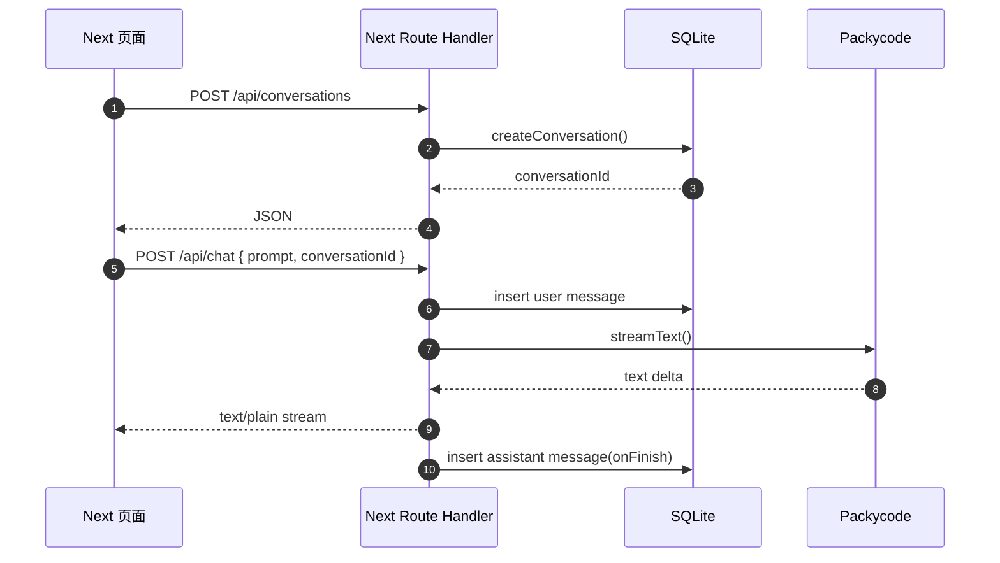
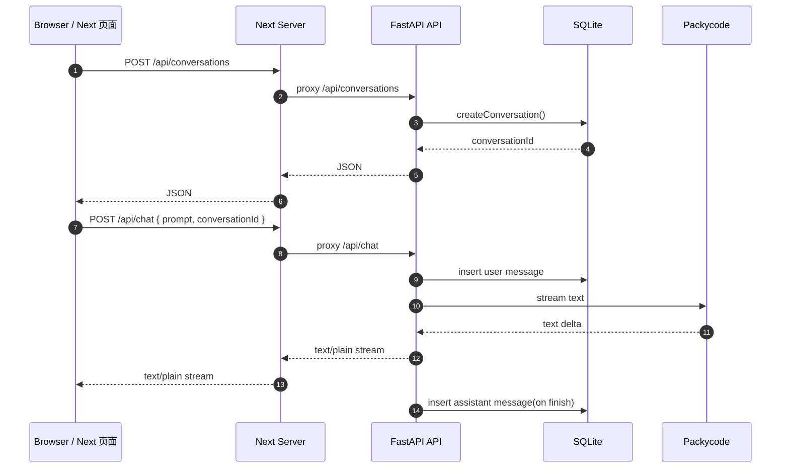

# 从 Next.js Route Handler 到 FastAPI：AI Requirement Assistant 迁移实战教程

## 1. 背景与目标

### 背景

当前项目是一个基于 [[Next.js App Router]] 的 AI 需求助手原型。它已经具备一条清晰可跑通的主链路：

`输入 -> /api/chat -> Packycode -> 文本流 -> 页面显示`

这条链路里同时包含了三个层次：

- 页面层：负责输入框、消息列表、错误提示、停止生成。
- API 层：负责收请求、调用上游模型、把结果流式返回给前端。
- 持久化层：负责把会话和消息存到本地 `SQLite`。

当前关键文件分别是：

- 页面入口：[src/app/page.tsx](/d:/code%20Files/nextjs-demo/ai-requirement-assistant/src/app/page.tsx)
- 聊天接口：[src/app/api/chat/route.ts](/d:/code%20Files/nextjs-demo/ai-requirement-assistant/src/app/api/chat/route.ts)
- 会话存储：[src/lib/server/chat-store.ts](/d:/code%20Files/nextjs-demo/ai-requirement-assistant/src/lib/server/chat-store.ts)

### 目标

这次不是直接“重写一遍项目”，而是做一条对学习成本和迁移风险都更友好的路线：

- 保留现有 Next.js 页面。
- 把 `src/app/api/**/route.ts` 里的后端职责迁到 [[FastAPI]]。
- 继续保留当前前端协议：
  - 请求：`{ prompt, conversationId }`
  - 响应：`text/plain` 流
- 保留 `SQLite` 作为当前阶段的持久化方案。
- 开发期通过 `Next -> FastAPI` 反向代理来联调，避免一开始就引入 `CORS` 和多环境地址切换问题。

### 非目标

这篇教程刻意不展开这些下一阶段问题：

- Docker 化部署
- PostgreSQL 替换
- 鉴权与多用户体系
- SSE / 结构化消息流升级
- Responses API 全量切换

## 2. 迁移前架构：先看清现在项目是怎么跑的

### 2.1 页面、API、SQLite 分别在哪

当前代码分布可以这样理解：

- `src/app/page.tsx`
  - 页面主入口
  - 用 `useCompletion()` 请求 `/api/chat`
  - 本地维护消息列表和当前会话 id
- `src/app/api/chat/route.ts`
  - 读取 `prompt` 和 `conversationId`
  - 校验环境变量
  - 调用 Packycode 模型
  - 把结果转成纯文本流返回
- `src/app/api/conversations/route.ts`
  - 创建会话
  - 列出会话
- `src/app/api/conversations/[id]/route.ts`
  - 返回会话详情和消息列表
- `src/lib/server/chat-store.ts`
  - 初始化 `data/chat.db`
  - 建表、建索引
  - 提供 `createConversation`、`insertMessage`、`listMessagesByConversationId` 等存储函数

### 2.2 当前链路图



### 2.3 为什么不建议这次直接推倒重做

如果你这次直接把“页面 + API + 存储 + 协议”一起换掉，会同时发生四类变化：

- 前端框架职责变化
- 后端框架变化
- 流式协议变化
- 联调方式变化

这样一来，出了问题你会很难判断到底是哪一层导致的。

这个项目的目标一直强调两件事：

- 主链路要清晰
- 问题要容易排查

所以更合理的做法是：

- 页面先不动
- 协议先不动
- 先替换 API 层
- 等 FastAPI 版本稳定之后，再决定要不要升级协议或数据库

## 3. 迁移后架构：新的边界应该长什么样

### 3.1 新边界

迁移后，职责边界变成：

- Next.js：只负责页面、交互、样式、前端状态。
- FastAPI：负责 `/api/*`、模型调用、SQLite、健康检查。
- 浏览器：仍然只请求 `/api/chat`、`/api/conversations` 这些相对路径。

### 3.2 迁移后链路图



### 3.3 为什么继续保留 `text/plain` 流

因为当前前端已经明确依赖这一点：

```tsx
useCompletion({
  api: "/api/chat",
  streamProtocol: "text",
})
```

这段配置的意思是：前端希望后端返回“纯文本流”，而不是 JSON，也不是一条条结构化 SSE 事件。

如果你现在顺手把后端改成 SSE 或结构化消息流，就不只是迁移 FastAPI 了，而是连前端消费逻辑一起改。

本次迁移先保留 `text/plain`，好处有三个：

- 前端几乎不用改。
- 迁移范围更可控。
- 如果流式显示坏了，能更快定位是代理问题还是 FastAPI 问题。

### 3.4 为什么开发期推荐 Next 反向代理到 FastAPI

开发期推荐的连接方式是：

- 浏览器请求 Next 的 `/api/*`
- Next 再转发给 `http://127.0.0.1:8000/api/*`

推荐这个方案，不是因为它最“纯”，而是因为它最适合当前项目：

- 你不用立刻处理 CORS。
- 页面里不用到处切换后端地址。
- 前端请求代码几乎不变。
- 学习时可以先聚焦“FastAPI 是否正确承接原 API 职责”。

## 4. 目录调整教程：哪些文件保留，哪些迁移，哪些删除

### 4.1 迁移后建议目录

```text
src/
  app/
    page.tsx
    layout.tsx
    globals.css
  components/
    chat/
  lib/
    chat/
  types/

backend/
  app/
    main.py
    schemas.py
    routers/
      chat.py
      conversations.py
      health.py
    services/
      chat_store.py
      packycode_client.py
      settings.py

docs/
```

### 4.2 每个目标目录的职责

- `src/app`
  - 继续放页面和前端 UI。
  - 不再承担聊天 API 的真实实现。
- `src/components/chat`
  - 继续放消息列表、输入框、错误提示等组件。
- `src/types`
  - 保留前端需要的 `ChatMessage`、持久化记录类型定义。
- `backend/app/main.py`
  - FastAPI 入口。
  - 注册路由、基础中间件、健康检查。
- `backend/app/routers`
  - 按资源拆分 API 路由。
  - 避免所有接口都塞进一个文件。
- `backend/app/services/chat_store.py`
  - 迁移当前 `chat-store.ts` 的存储职责。
- `backend/app/services/packycode_client.py`
  - 封装 Packycode OpenAI-compatible 调用，避免路由层直接写模型调用细节。
- `backend/app/services/settings.py`
  - 统一读取和校验环境变量。
- `backend/app/schemas.py`
  - 放 Pydantic 请求体和响应体。

### 4.3 保留、迁移、删除清单

#### 保留

- [src/app/page.tsx](/d:/code%20Files/nextjs-demo/ai-requirement-assistant/src/app/page.tsx)
- [src/components/chat/message-list.tsx](/d:/code%20Files/nextjs-demo/ai-requirement-assistant/src/components/chat/message-list.tsx)
- [src/components/chat/prompt-form.tsx](/d:/code%20Files/nextjs-demo/ai-requirement-assistant/src/components/chat/prompt-form.tsx)
- [src/components/chat/error-banner.tsx](/d:/code%20Files/nextjs-demo/ai-requirement-assistant/src/components/chat/error-banner.tsx)
- [src/types/chat.ts](/d:/code%20Files/nextjs-demo/ai-requirement-assistant/src/types/chat.ts)
- [src/types/persistence.ts](/d:/code%20Files/nextjs-demo/ai-requirement-assistant/src/types/persistence.ts)

#### 迁移

- [src/lib/server/chat-store.ts](/d:/code%20Files/nextjs-demo/ai-requirement-assistant/src/lib/server/chat-store.ts)
  - 迁到 `backend/app/services/chat_store.py`
- [src/app/api/health/network/route.ts](/d:/code%20Files/nextjs-demo/ai-requirement-assistant/src/app/api/health/network/route.ts)
  - 迁到 `backend/app/routers/health.py`
- [src/app/api/chat/route.ts](/d:/code%20Files/nextjs-demo/ai-requirement-assistant/src/app/api/chat/route.ts)
  - 迁到 `backend/app/routers/chat.py`
- [src/app/api/conversations/route.ts](/d:/code%20Files/nextjs-demo/ai-requirement-assistant/src/app/api/conversations/route.ts)
  - 迁到 `backend/app/routers/conversations.py`
- [src/app/api/conversations/[id]/route.ts](/d:/code%20Files/nextjs-demo/ai-requirement-assistant/src/app/api/conversations/[id]/route.ts)
  - 迁到 `backend/app/routers/conversations.py`

#### 删除

- `src/app/api/**/route.ts`
  - 等 FastAPI 接口验证通过、Next 代理接上之后再删除。

这里要注意顺序：不要一开始就删 Next Route Handler。先做 FastAPI，先验证，最后再切换。

## 5. 接口迁移教程：逐个看怎么从 Next 映射到 FastAPI

### 5.1 `POST /api/chat`

#### 当前 Next.js 做法

- 从 `request.json()` 里取 `prompt` 和 `conversationId`
- 校验 `PACKYCODE_API_KEY`、`PACKYCODE_BASE_URL`
- 校验会话是否存在
- 先插入 user message
- 调用上游模型拿流式文本
- 流结束后再插入 assistant message
- 返回 `text/plain` 流

#### FastAPI 对应写法

```python
from fastapi import APIRouter, HTTPException
from fastapi.responses import StreamingResponse
from app.schemas import ChatRequest
from app.services.chat_store import (
    get_conversation_by_id,
    insert_message,
    touch_conversation,
)
from app.services.packycode_client import stream_chat_text

router = APIRouter(prefix="/api")


@router.post("/chat")
async def post_chat(body: ChatRequest):
    prompt = body.prompt.strip()
    conversation_id = body.conversationId.strip()

    if not prompt:
        raise HTTPException(status_code=400, detail="prompt is required")

    if not conversation_id:
        raise HTTPException(status_code=400, detail="conversationId is required")

    if not get_conversation_by_id(conversation_id):
        raise HTTPException(status_code=404, detail="conversation not found")

    insert_message(conversation_id=conversation_id, role="user", content=prompt)
    touch_conversation(conversation_id)

    collected_chunks: list[str] = []

    async def event_stream():
        async for chunk in stream_chat_text(prompt):
            collected_chunks.append(chunk)
            yield chunk

        final_text = "".join(collected_chunks).strip()
        if final_text:
            insert_message(
                conversation_id=conversation_id,
                role="assistant",
                content=final_text,
            )
            touch_conversation(conversation_id)

    return StreamingResponse(
        event_stream(),
        media_type="text/plain; charset=utf-8",
    )
```

#### 为什么这样映射

- `ChatRequest` 对应当前前端请求体。
- `StreamingResponse` 对应当前 `text/plain` 流。
- `collected_chunks` 的作用是把完整 assistant 内容拼出来，等流结束后再写库。
- 这能保持和当前 Next 版本相同的行为：不把半截 assistant 内容写进数据库。

### 5.2 `GET /api/conversations`

#### 当前 Next.js 做法

- 调用 `listConversations()`
- 直接返回会话摘要列表

#### FastAPI 对应写法

```python
@router.get("/conversations")
def get_conversations():
    return {"conversations": list_conversations()}
```

#### 为什么这样映射

- 前端需要的是“列表容器 + 会话数组”这种响应结构。
- 保持返回结构不变，可以避免前端一起修改。

### 5.3 `POST /api/conversations`

#### 当前 Next.js 做法

- 从请求体里拿 `title`
- 创建会话
- 返回 `conversationId`、标题、创建时间、更新时间

#### FastAPI 对应写法

```python
from app.schemas import CreateConversationRequest
from app.services.chat_store import create_conversation


@router.post("/conversations")
def post_conversation(body: CreateConversationRequest):
    conversation = create_conversation(body.title)
    return {
        "conversationId": conversation["id"],
        "title": conversation["title"],
        "createdAt": conversation["createdAt"],
        "updatedAt": conversation["updatedAt"],
    }
```

#### 为什么这样映射

- 页面里的 `ensureConversationId()` 依赖 `conversationId` 这个字段名。
- 如果你改成 `id`，前端就要跟着改，不适合这次“后端替换优先”的迁移目标。

### 5.4 `GET /api/conversations/{id}`

#### 当前 Next.js 做法

- 从动态路由参数里取 `id`
- 查询会话是否存在
- 返回会话详情和消息列表

#### FastAPI 对应写法

```python
@router.get("/conversations/{conversation_id}")
def get_conversation_detail(conversation_id: str):
    conversation = get_conversation_by_id(conversation_id.strip())
    if not conversation:
        raise HTTPException(status_code=404, detail="conversation not found")

    return {
        "conversation": conversation,
        "messages": list_messages_by_conversation_id(conversation_id),
    }
```

#### 为什么这样映射

- FastAPI 的路径参数天然适合承接 Next 的 `[id]` 路由语义。
- 前端如果以后做会话恢复，这个接口的数据结构可以直接沿用。

### 5.5 `GET /api/health/network`

#### 当前 Next.js 做法

- 检查 `PACKYCODE_BASE_URL` 和 `PACKYCODE_API_KEY`
- 请求上游 `/models`
- 返回是否连通、耗时、状态码、代理配置

#### FastAPI 对应写法

```python
import time
import httpx
from fastapi import HTTPException


@router.get("/health/network")
async def get_network_health():
    started_at = time.time()
    target = f"{settings.packycode_base_url.rstrip('/')}/models"

    try:
        async with httpx.AsyncClient(timeout=8.0) as client:
            response = await client.get(
                target,
                headers={"Authorization": f"Bearer {settings.packycode_api_key}"},
            )
        return {
            "ok": response.is_success,
            "message": "network is reachable" if response.is_success else "upstream returned non-2xx",
            "durationMs": int((time.time() - started_at) * 1000),
            "target": target,
            "status": response.status_code,
            "details": response.text[:240] or None,
        }
    except Exception as error:
        raise HTTPException(status_code=503, detail=str(error))
```

#### 为什么这样映射

- 这个接口的价值不在“业务”，而在排错。
- 迁移到 FastAPI 后，它仍然是你判断“问题在代理、后端，还是上游模型”的第一检查点。

## 6. 流式聊天迁移教程：最容易出问题的一段

### 6.1 `useCompletion({ streamProtocol: "text" })` 在要求什么

这段前端代码并不只是“调用接口”这么简单，它其实规定了后端的返回协议：

```tsx
const { complete, completion, isLoading, error } = useCompletion({
  api: "/api/chat",
  streamProtocol: "text",
})
```

这意味着：

- 前端发请求时，默认仍然按 `prompt` 契约交互。
- 前端期望服务端返回纯文本流。
- `completion` 会边接收边增长。

所以 FastAPI 必须满足两点：

- 返回 `StreamingResponse`
- `media_type` 是 `text/plain; charset=utf-8`

### 6.2 为什么不能把 assistant 消息一边流一边写库

你可能会想：既然流式返回时已经拿到片段了，为什么不每来一个 chunk 就写一次数据库？

因为这样会制造三个问题：

- 数据库里容易出现半截 assistant 文本。
- 中途报错时，很难判断那条记录到底算成功还是失败。
- 恢复历史会话时，你会看到不完整回答。

当前项目的策略更稳：

- 用户消息先入库
- assistant 消息等流完整结束后再入库

这个策略建议在 FastAPI 版继续保留。

### 6.3 推荐的 Packycode 调用封装方式

不要在路由里直接写模型客户端初始化和流式调用。推荐单独封装成服务：

```python
from openai import AsyncOpenAI
from app.services.settings import settings

client = AsyncOpenAI(
    api_key=settings.packycode_api_key,
    base_url=settings.packycode_base_url,
)


async def stream_chat_text(prompt: str):
    stream = await client.chat.completions.create(
        model=settings.packycode_model,
        messages=[{"role": "user", "content": prompt}],
        stream=True,
    )

    async for chunk in stream:
        delta = chunk.choices[0].delta.content or ""
        if delta:
            yield delta
```

这样分层的好处是：

- 路由更容易读。
- 后续如果要改成 Responses API，只需要主要替换服务层。
- 出问题时更容易判断是“路由层问题”还是“模型调用层问题”。

## 7. SQLite 迁移教程：把 `chat-store.ts` 翻译成 Python 思维

### 7.1 当前 `chat-store.ts` 在做什么

这个文件不是简单的“数据库连接文件”，它承担了完整的存储职责：

- 确保 `data/chat.db` 存在
- 初始化表结构和索引
- 生成会话标题
- 创建会话
- 查询会话
- 查询消息列表
- 写入消息
- 刷新会话更新时间

所以迁移时不要只想着“换个语法”。你真正要保留的是这组职责。

### 7.2 Python 版建议保留的函数

推荐把 `chat_store.py` 做成下面这组函数：

```python
def create_database() -> sqlite3.Connection: ...
def create_conversation(title: str) -> dict: ...
def get_conversation_by_id(conversation_id: str) -> dict | None: ...
def list_conversations() -> list[dict]: ...
def list_messages_by_conversation_id(conversation_id: str) -> list[dict]: ...
def insert_message(conversation_id: str, role: str, content: str) -> dict: ...
def touch_conversation(conversation_id: str) -> None: ...
```

### 7.3 建表与索引为什么不能漏

至少要保留和当前 Node 版本同等的结构：

```sql
create table if not exists conversations (
  id text primary key,
  title text not null,
  created_at text not null,
  updated_at text not null
);

create table if not exists messages (
  id text primary key,
  conversation_id text not null,
  role text not null check(role in ('user', 'assistant')),
  content text not null,
  created_at text not null,
  foreign key (conversation_id) references conversations(id)
);

create index if not exists idx_conversations_updated_at
on conversations(updated_at desc);

create index if not exists idx_messages_conversation_id_created_at
on messages(conversation_id, created_at asc);
```

这些不是“锦上添花”，而是决定行为正确性的基础：

- `updated_at desc` 影响会话列表排序。
- `conversation_id + created_at asc` 影响消息恢复顺序。
- `role check` 可以提前拦住脏数据。

### 7.4 推荐的 Python 版核心片段

```python
import sqlite3
from pathlib import Path

DB_PATH = Path("data/chat.db")


def get_connection() -> sqlite3.Connection:
    DB_PATH.parent.mkdir(parents=True, exist_ok=True)
    conn = sqlite3.connect(DB_PATH)
    conn.row_factory = sqlite3.Row
    return conn
```

这里要理解两点：

- `row_factory = sqlite3.Row` 可以让你更方便地按字段名读取结果。
- 当前阶段用标准库 `sqlite3` 就够了，不必为了“看起来高级”先上 ORM。

## 8. Next 代理接入教程：为什么页面代码几乎不用改

### 8.1 目标效果

即使 FastAPI 已经接管后端，前端页面仍然继续这样写：

```tsx
useCompletion({
  api: "/api/chat",
  streamProtocol: "text",
})
```

页面不知道后面已经换成 Python，它只知道自己在请求 `/api/chat`。

### 8.2 推荐的 `next.config.ts` 写法

```ts
import type { NextConfig } from "next";

const fastApiBaseUrl =
  process.env.FASTAPI_BASE_URL || "http://127.0.0.1:8000";

const nextConfig: NextConfig = {
  async rewrites() {
    return [
      {
        source: "/api/:path*",
        destination: `${fastApiBaseUrl}/api/:path*`,
      },
    ];
  },
};

export default nextConfig;
```

### 8.3 这段代理到底解决了什么

- 让浏览器仍然保持同源请求。
- 让前端请求代码不用统一替换成 `http://127.0.0.1:8000/...`
- 把“跨域和地址配置问题”从第一阶段迁移里先剥离掉。

### 8.4 它的代价是什么

代理不是没有成本。你要知道它新增了一层定位路径：

- 页面异常，可能是前端问题
- 也可能是 Next 代理问题
- 也可能是 FastAPI 自己的问题

所以联调时要学会分层验证。

## 9. 启动与联调教程：建议按这个顺序做

### 9.1 新增的 Python 侧配置

本次迁移至少会新增或显式使用这些配置：

- `FASTAPI_BASE_URL`
- `PACKYCODE_API_KEY`
- `PACKYCODE_BASE_URL`
- `PACKYCODE_MODEL`
- `CHAT_DB_PATH`

推荐理解方式是：

- `FASTAPI_BASE_URL` 给 Next 代理用
- 其他四个给 FastAPI 自己用

### 9.2 推荐的本地启动顺序

先启动 FastAPI：

```bash
uvicorn backend.app.main:app --reload --port 8000
```

再启动 Next：

```bash
npm run dev
```

### 9.3 为什么要先测 FastAPI，再接 Next 代理

推荐顺序：

1. 先直接请求 FastAPI 接口
2. 再接 Next rewrites
3. 最后再打开页面联调

因为这样能帮你减少排错维度：

- 如果 FastAPI 直连都不通，先别怀疑 Next。
- 如果 FastAPI 直连能流式返回，但页面不行，再去看代理和前端。

### 9.4 联调时最实用的检查顺序

#### 第一步：直接测会话接口

```bash
curl -X POST http://127.0.0.1:8000/api/conversations ^
  -H "Content-Type: application/json" ^
  -d "{\"title\":\"test\"}"
```

#### 第二步：直接测聊天接口

```bash
curl -N -X POST http://127.0.0.1:8000/api/chat ^
  -H "Content-Type: application/json" ^
  -d "{\"prompt\":\"hello\",\"conversationId\":\"your-id\"}"
```

#### 第三步：再测浏览器页面

- 页面发送消息
- 观察 assistant 是否逐字出现
- 看 Next 终端有没有代理报错
- 看 FastAPI 终端有没有模型调用或写库报错

## 10. 常见错误与定位思路

### 10.1 协议不匹配

典型现象：

- 页面发出请求，但 assistant 没有流式显示
- 浏览器没有明确报错，看起来像“卡住”

优先检查：

- 前端是不是还在按 `streamProtocol: "text"` 消费
- FastAPI 返回的是不是 `text/plain`
- 是否误改成 JSON 或 SSE

### 10.2 代理问题

典型现象：

- FastAPI 直连正常
- 页面请求失败或无流式效果

优先检查：

- `FASTAPI_BASE_URL` 是否正确
- `next.config.ts` 的 rewrites 是否生效
- Next 终端是否有转发报错

### 10.3 上游模型调用失败

典型现象：

- 会话能创建
- 聊天请求进入 FastAPI
- 但流式调用很快失败或直接 500

优先检查：

- `PACKYCODE_API_KEY`
- `PACKYCODE_BASE_URL`
- `PACKYCODE_MODEL`
- `/api/health/network`

### 10.4 SQLite 写入问题

典型现象：

- 页面能看到回复
- 但刷新后历史消息不完整或没保存

优先检查：

- `data/chat.db` 是否真正被 FastAPI 使用
- assistant 消息是否只在流结束后写入
- `touch_conversation()` 是否执行

### 10.5 看哪里最有用

- 浏览器 DevTools
  - 看请求是否发出、响应头是什么、返回是不是流式
- Next 终端
  - 看代理层是否报错
- FastAPI 终端
  - 看模型调用和数据库写入错误

判断原则很简单：

- 请求没出浏览器，先看前端
- 请求到了 Next 没到 FastAPI，先看代理
- 请求到了 FastAPI 但上游失败，先看模型调用
- 流式显示正常但历史恢复不对，先看 SQLite

## 11. 最终验收清单

迁移完成后，至少确认下面这些点：

- 页面仍能正常创建会话
- 页面仍能正常发送消息
- assistant 文本是流式出现，不是最后一次性出现
- 会话列表按最近更新时间排序
- 刷新后能恢复历史消息
- 重试、停止生成、清空会话等现有页面行为没有明显退化
- `/api/health/network` 仍能用于排查上游连通性
- `npm run lint` 通过
- `npm run build` 通过
- FastAPI 接口测试通过

## 12. 结论：这次迁移真正要学会什么

从学习角度看，这次迁移最重要的不是“把 TypeScript 改成 Python”，而是学会这几个判断：

- 哪些层可以先不动，先把变更范围收窄
- 哪些前端契约必须保留，否则会引发连锁修改
- 为什么流式接口的协议不能随便换
- 为什么排错时要按“前端 -> 代理 -> FastAPI -> 上游模型 -> SQLite”分层检查

如果你能把这些判断建立起来，这次迁移就不只是“改完了”，而是真的学会了如何把一个原型项目稳稳地从一种后端路线迁到另一种路线。

## 13. Related Notes

- [[api-chat-route-explanation]]
- [[api-chat-timeout-debug-playbook]]
- [[api-health-network-route-explanation]]
- [[FastAPI 迁移 FAQ：为什么这样改，以及常见坑]]
